# 🌟DataFlow-EDU: 端到端学科语料库&Benchmark生成

> From One to Infinity 🌈

> Github Repo: <link>https://github.com/Heartune/DataFlow-EDU</link>

> 教师友好 Web 入口（M1 本地开发版）：
> 1. `cd webui/server && cp .env.example .env`（按需改 `JWT_SECRET / ADMIN_*`），`npm install && npm run dev`
> 2. `cd webui/frontend && npm install && npm run dev`，浏览器访问 Vite 输出的地址（默认 http://127.0.0.1:5173 ）
> 3. 注册账号 → 新建任务 → 上传教材 PDF → 填 BYOK key → 实时观察阶段进度。所有产物落 `dataflow_edu/data/users/<uid>/<task_id>/`。

## 核心定位说明

基于我在包含7.9万条语料的机器人理论语料库ROBOTheory-79k、规模1.6T网络安全专业语料库CyberSecCorpus、电子信息学科数据集EE-Bench、中国法律大模型评测基准CNLaw-Bench方面的丰富构建经验，我的核心目标是打造 **DataFlow-EDU**——一条高度自动化、算子化且具备通用性的「学科数据集与评测基准（Benchmark）」生产管线。该管线贯穿从「原始教材输入」到「高质量结构化题库输出」的全生命周期。它不仅包含基于 MinerU 的多模态文档解析、切片式题库生成与题型动态均衡模块，更深度融入了目标团队 DataFlow 的算子化清洗哲学。通过灵活串联条件过滤、领域对齐 与基于 Question Verify 的 LLM-as-a-Judge 多维能力审阅等定制化算子，最终实现自动化、批量化地生产低幻觉、高质量、均衡分布的学科评测集与训练语料，成为赋能各类学科大模型能力跃升的基础设施。这套系统支持包括教材在内的任意PDF教学资源输入，这里我将以一本高中生物必修一教材（PDF格式）作为资源，进行项目demo演示。

---

## 📖 Introducing DataFlow-EDU

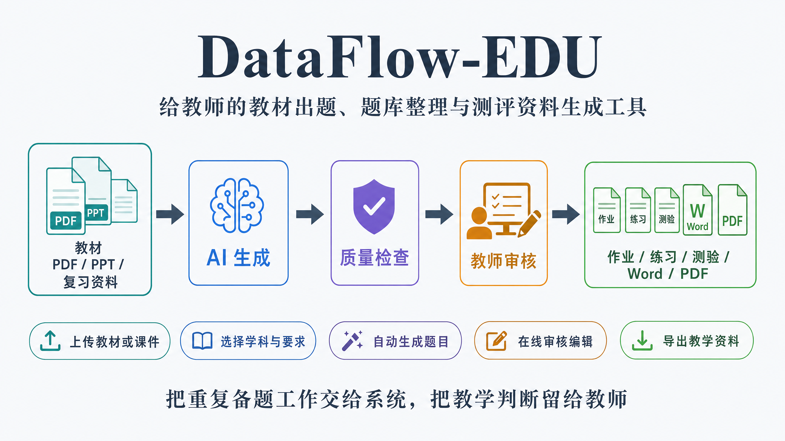

---

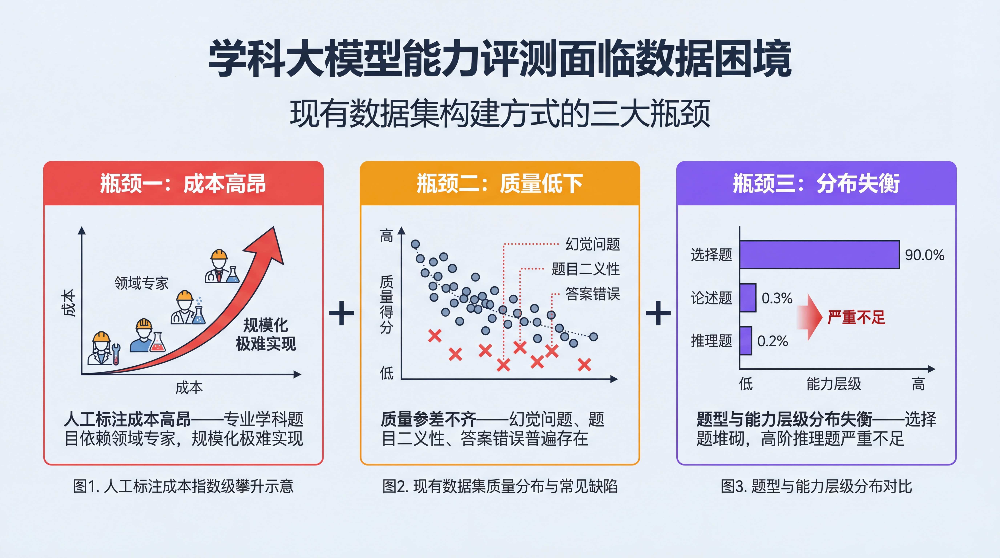

---

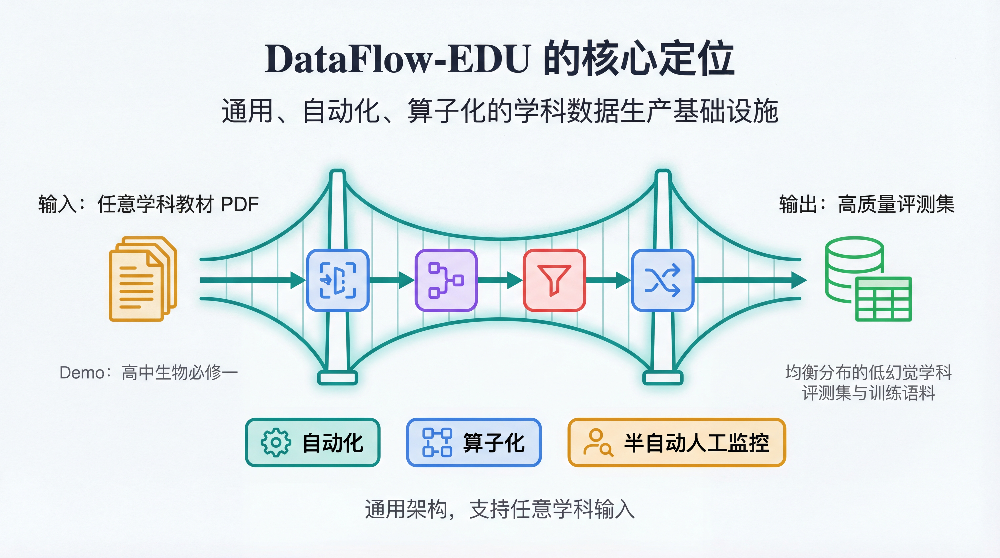

---

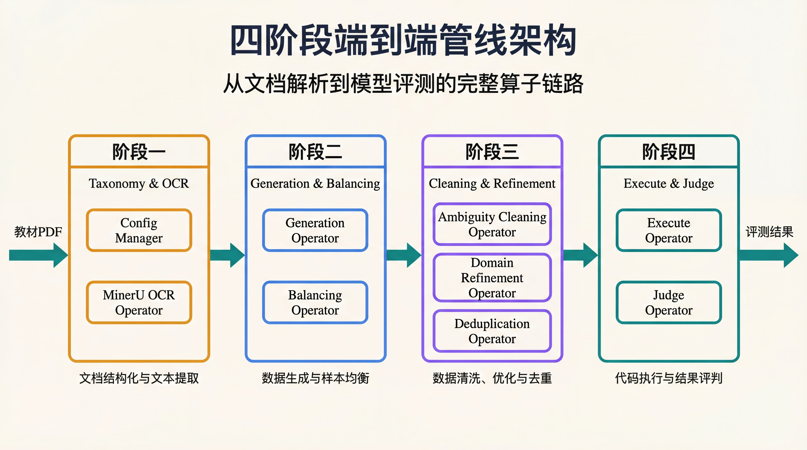

---

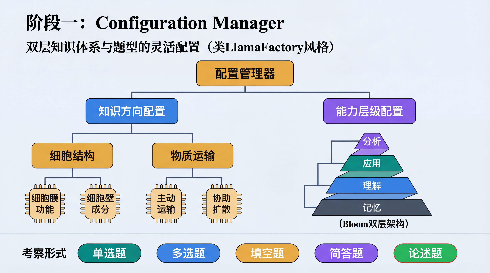

---

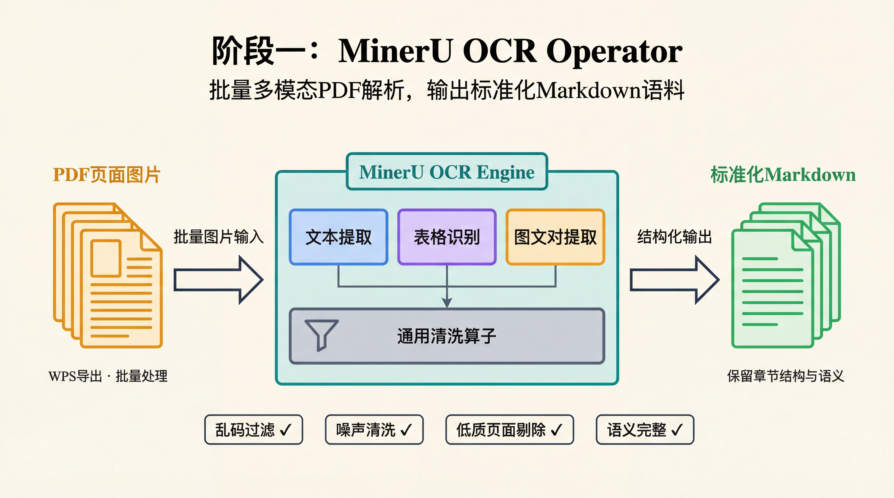

---

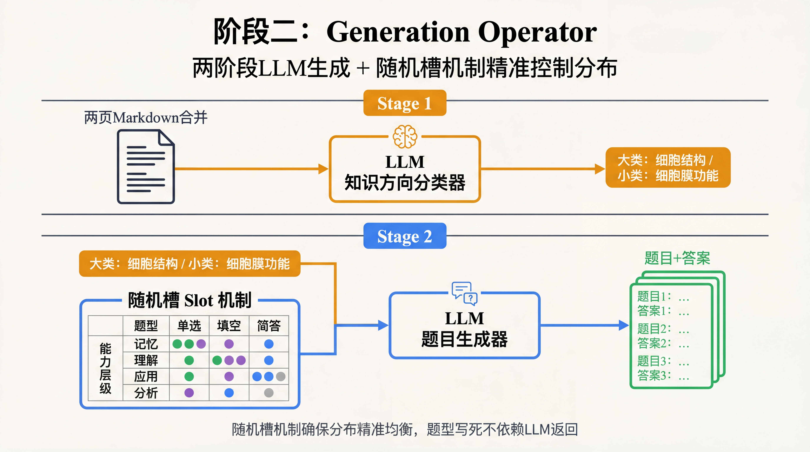

---

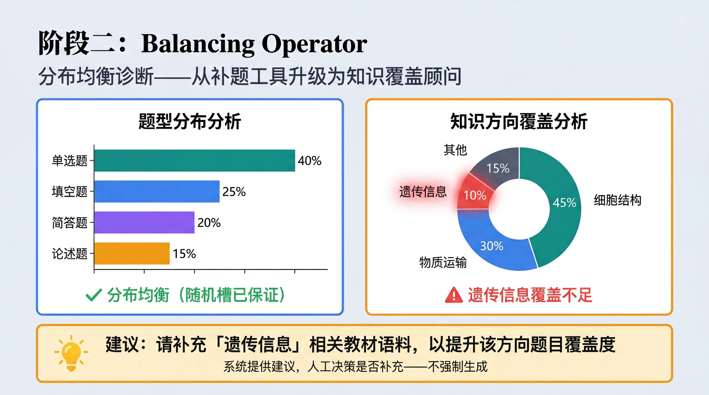

---

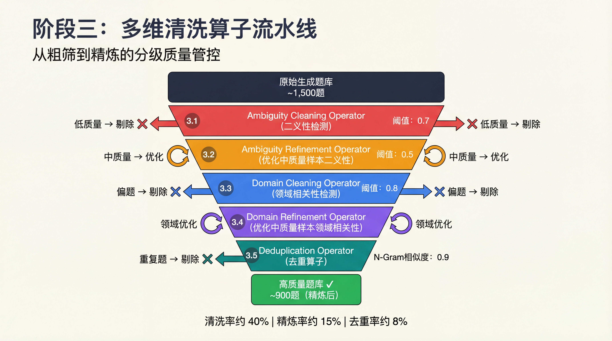

---

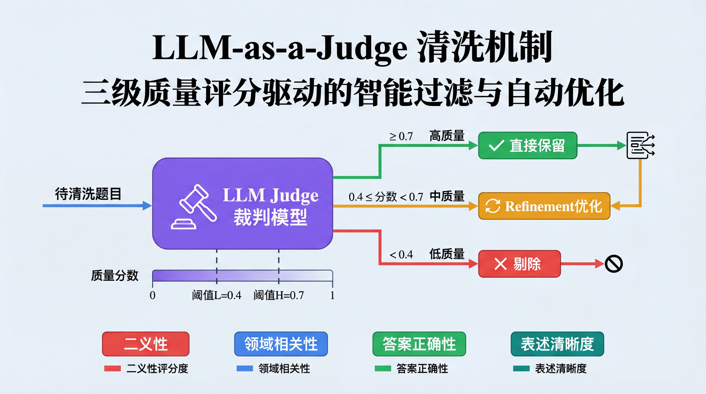

---

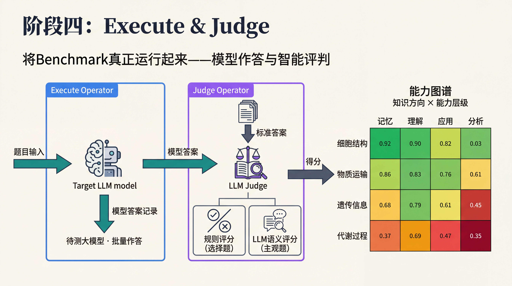

---

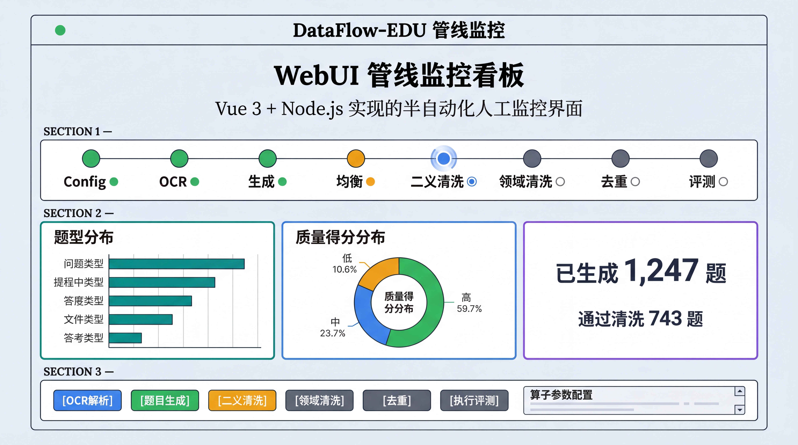

---

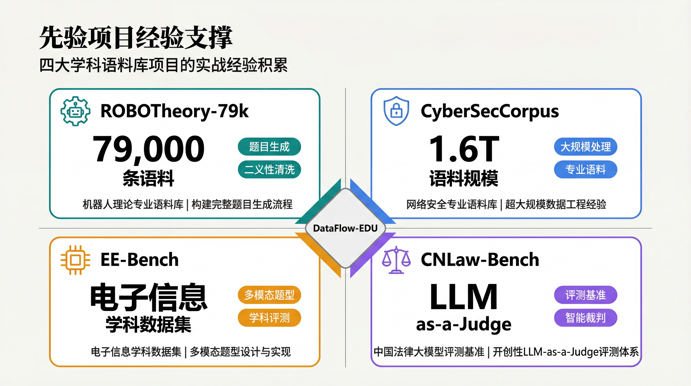

---

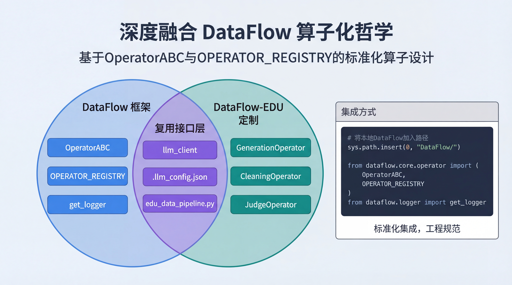

---

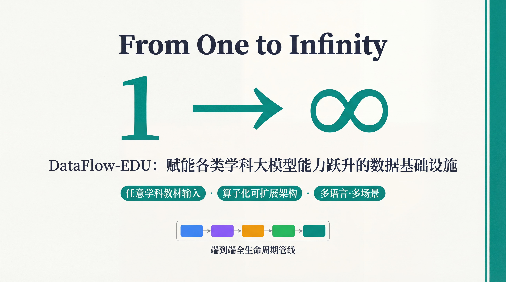

---

## Star History

<a href="https://www.star-history.com/?repos=Heartune%2FDataFlow-EDU&type=date&legend=top-left">
 <picture>
   <source media="(prefers-color-scheme: dark)" srcset="https://api.star-history.com/image?repos=Heartune/DataFlow-EDU&type=date&theme=dark&legend=top-left" />
   <source media="(prefers-color-scheme: light)" srcset="https://api.star-history.com/image?repos=Heartune/DataFlow-EDU&type=date&legend=top-left" />
   
 </picture>
</a>

---

## DataFlow-EDU 方案设计图景

我将这套 Workflow 映射到 DataFlow 的算子化 Operator 和管线化 Pipeline 架构中。

注意，所有算子都要是命令行交互式的，如果当前要实现的算子的参考代码不是交互式的，那么要参考前面已经实现的算子的相关代码，进行设计。我的pipeline不是那种全自动的，是半自动的，人工的监控、管理和介入是必要的。

整体有一个edu_data_pipeline.py，里面是对各个operator的调用，通过命令行交互式，用户可以选择执行哪个算子，即执行Workflow的哪个步骤。

项目应使用本地的 DataFlow 包（包含 get_logger、OperatorABC、OPERATOR_REGISTRY 等）。相关代码应将本地 DataFlow 加入 sys.path。

涉及 LLM 交互的部分，可复用 `dataflow_edu.serving.llm_client`。该模块位于 `dataflow_edu/serving/` 目录下，作为通用 LLM 客户端，被需要它的算子共用。配置保存于项目根目录的 `.llm_config.json`。


### 其他工具

对于CNLawbench和ROBOTheory两个项目产出的json转excel、excel转jsonl这些工具脚本，整理放在utils文件夹下。

### WebUI

Pipeline 看板（Vue 3 + Node.js）位于 `webui/`。启动方式：`cd webui && npm install && npm run dev`。

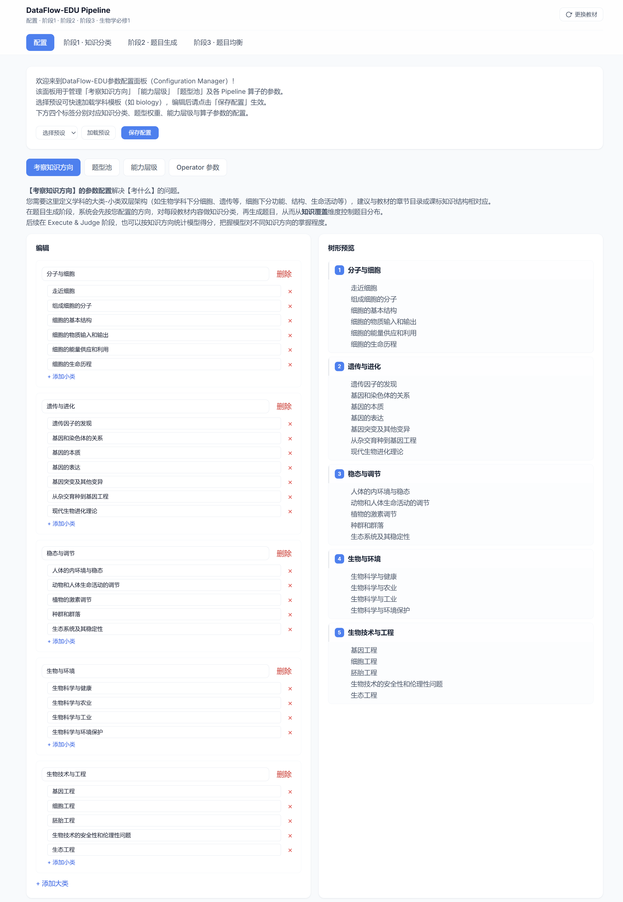

---

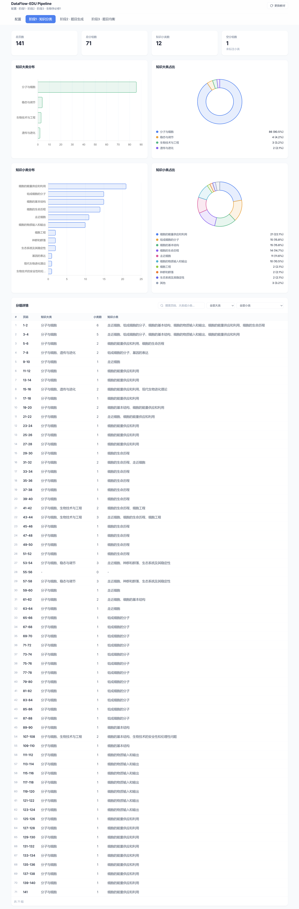

---

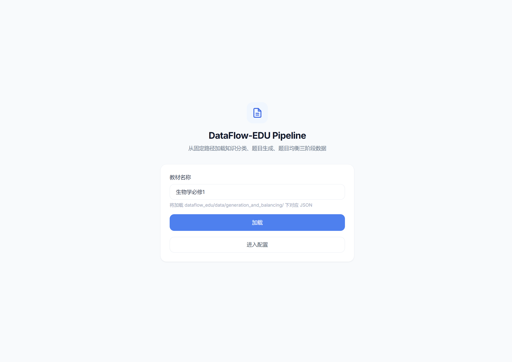

---

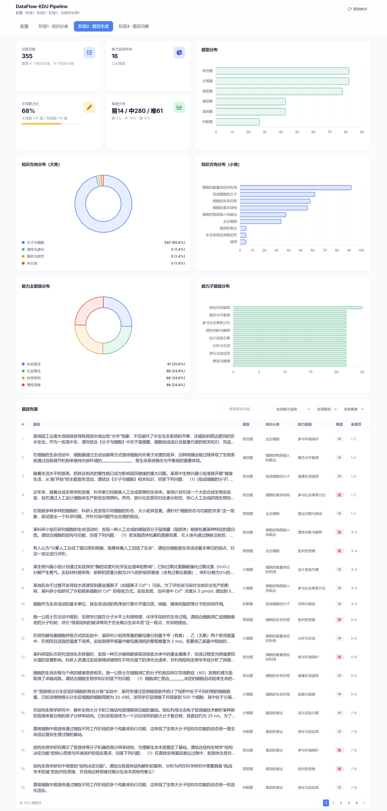

---

## 项目文件结构

```
DataFlow-EDU/
├── README.md
├── docker-compose.yml        # 单机生产部署：worker + web + backup
├── Dockerfile.python         # worker 镜像：Node API + Python Pipeline
├── Dockerfile.web            # Nginx 前端静态服务镜像
├── requirements-cloud.txt    # 云端/容器 Python 依赖
├── .env                      # 本地环境变量，含密钥；需自行创建，不入库
├── .llm_config.json          # CLI 模式 LLM 配置；需自行创建，不入库
├── DataFlow/                 # 本地 DataFlow 框架源码，提供 OperatorABC、Registry 等
├── dataflow_edu/             # 教育题库生成主管线与算子包
│   ├── edu_data_pipeline.py  # 命令行交互式 Pipeline 入口
│   ├── task_runner.py        # WebUI 非交互式任务 Runner，写入 progress.json
│   ├── config/               # Schema、配置加载/校验、全局配置与初高中多学科 presets
│   ├── operators/            # DataFlow Operator 封装与 OPERATOR_REGISTRY 注册
│   ├── pipelines/            # MinerU OCR、题目生成等阶段 Pipeline 包装
│   ├── generation/           # 两阶段生成核心逻辑与分学科 prompt 模板
│   ├── balancing/            # 能力层级与题型分布均衡补题
│   ├── ambiguity_cleaning/   # 题意二义性评分与低质题剔除
│   ├── ambiguity_refinement/ # 二义性题目精修与重评
│   ├── domain_cleaning/      # 学科领域相关性评分与清洗
│   ├── domain_refinement/    # 领域相关性精修与重评
│   ├── deduplication/        # MinHash + LSH 题干去重
│   ├── synthesis/            # 基于题目与答案生成解析 explanation
│   ├── translation/          # 中英法多语言题目/答案/解析翻译
│   ├── mcq_verify/           # 选择题选项与答案结构校验/修复
│   ├── execute/, judge/      # 接入待测模型作答与 LLM-as-a-Judge 评分
│   ├── competency_suggest/   # 联网生成知识体系、题型、核心素养配置建议
│   ├── serving/              # 多 Provider LLM 客户端与联网搜索 LLM 客户端
│   ├── export/               # JSON / Word / PDF 试卷导出
│   └── data/                 # 教材资源、示例产物与多用户任务运行目录
├── webui/                    # 教师端与管理端 Web 应用
│   ├── frontend/             # Vue 3 + Vite + Pinia 前端
│   │   ├── src/              # 路由、页面、组件、stores、API client
│   │   ├── public/           # 静态品牌资源
│   │   └── dist/             # 当前生产构建产物
│   ├── server/               # Node.js/Express API 服务
│   │   └── src/              # auth、tasks、export、share、admin、folders 等路由
│   ├── img_intro/            # README/WebUI 介绍截图
│   └── README.md
├── deploy/                   # 部署辅助资源，如 PDF 导出字体说明
├── scripts/                  # 运维脚本，如 SQLite 备份
├── tests/                    # DataFlow-EDU 单元测试
├── slide-deck/dataflow-edu/  # 项目介绍 slide 源文件、提示词与导出成品
├── utils_from_CNLaw-Bench/   # 历史项目迁移工具，仅保留必要轻量脚本
└── utils_from_ROBOTheory/    # 历史项目迁移工具，本地参考为主
```

---

## Quick Start

1. **环境与依赖**
   - 确保项目根目录下的 `DataFlow` 目录存在（管线会通过 `sys.path` 使用本地 DataFlow 包）。
   - 在 `DataFlow`目录下运行 `pip install -e .`通过源码编译方式安装 DataFlow.

2. **配置**
   - 在项目根目录配置 LLM：创建 `.llm_config.json`，供生成、清洗、评测等算子调用大模型。
   - 建议优先通过 **WebUI 看板** 配置知识方向、能力层级、题型及各算子参数。启动 WebUI：在项目根目录执行 `cd webui && npm install && npm run dev`，浏览器访问 http://localhost:5173。也可在管线菜单中运行 **1.1 Configuration Manager**，或直接编辑 `dataflow_edu/config/edu_config.yaml`。

3. **运行管线**
   - 在项目根目录执行：
     ```bash
     python -m dataflow_edu.edu_data_pipeline
     ```
   - 根据提示选择步骤：1.1 配置 → 1.2 MinerU OCR → 2.1 生成 → 2.2 均衡（可选）→ 阶段三清洗 → 4.1 执行 → 4.2 评判。

4. **查看进度与结果**
   - 启动 WebUI 看板：` npm run dev`，浏览器访问前端（如 http://localhost:5173）查看各阶段节点状态。
   - 生成与均衡结果在 `dataflow_edu/data/generation_and_balancing/`，执行与评判结果在 `dataflow_edu/data/execute_and_judge/`。

## PDF 导出字体

Word 导出会在 docx 中写入 `微软雅黑`。PDF 导出会先生成 docx，再由 LibreOffice
headless 转换成 PDF，因此最终 PDF 字体取决于运行 LibreOffice 的系统/容器是否能
通过 fontconfig 找到该字体。

如果部署环境需要嵌入真正的微软雅黑，请在构建 worker 镜像前，把合法授权的字体文件
放入 `deploy/fonts/`，常见文件名包括 `msyh.ttc`、`msyhbd.ttc`、`msyhl.ttc`，然后重建：

```bash
docker compose build worker
docker compose up -d worker
```

如果未提供真实微软雅黑，Docker 镜像会把 `微软雅黑` / `Microsoft YaHei` 映射到已安装
的中文黑体兜底字体，避免 LibreOffice 转 PDF 时回落到 DejaVu Sans 这类非中文字体。
这能保证中文显示稳定，但不是严格意义上的 Microsoft YaHei。

---

## TODO
- [ ] plan.md 中的计划
- [ ] 合并 1.1 和 1.2，直接解析 pdf，而非将 pdf 转为 image
- [ ] 平民化 webui 设计，完善参数配置自由度，开发拖动控件和实时进度预览
- [x] 贴合初高中多学科教育核心素养，如果没有适配领域，要调用能联网搜索的 LLM 给出建议，并支持修改或完全用户自定义（已通过 `CompetencySuggestOperator` + `POST /api/competency/suggest` + WizardView 第 2 步「联网建议」按钮实现）

```
