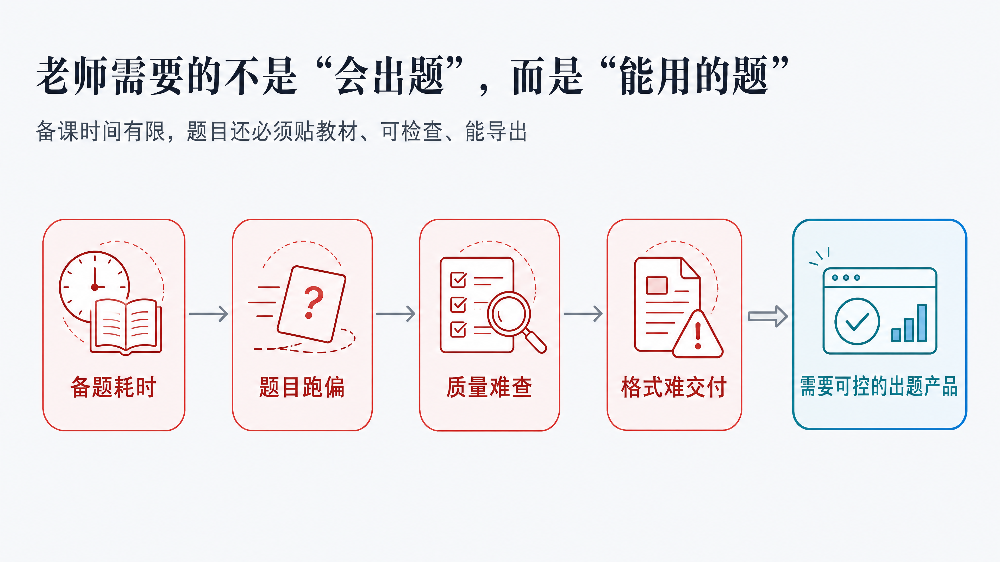
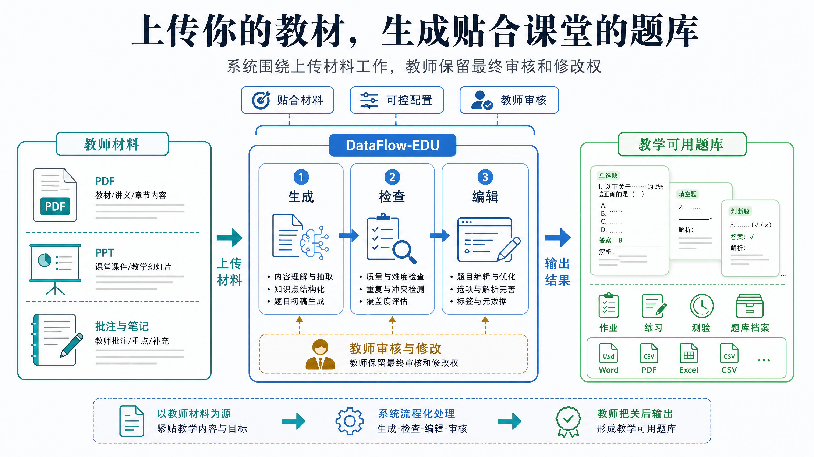
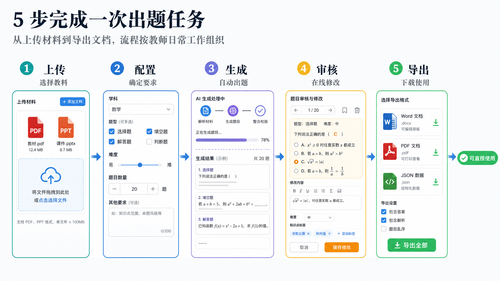
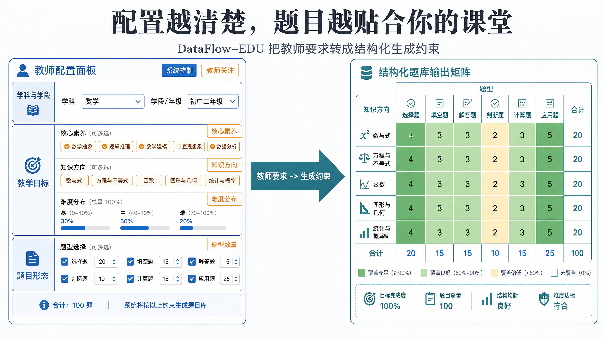
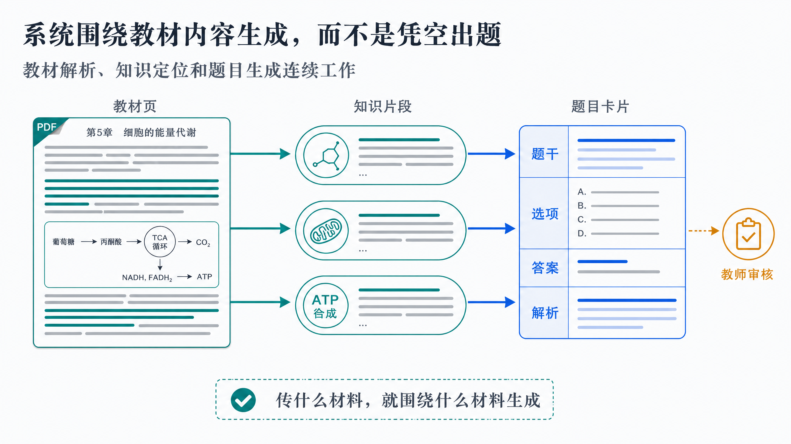
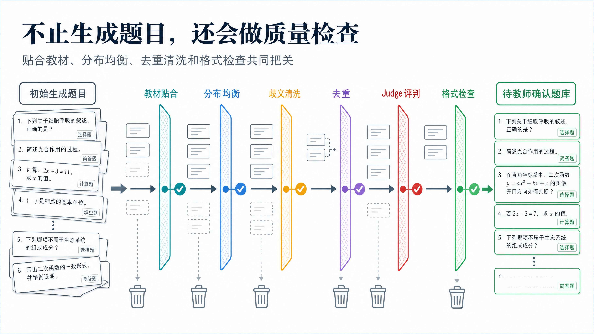
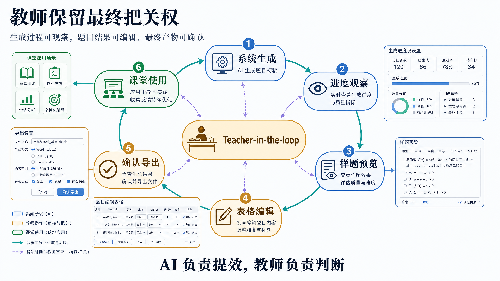
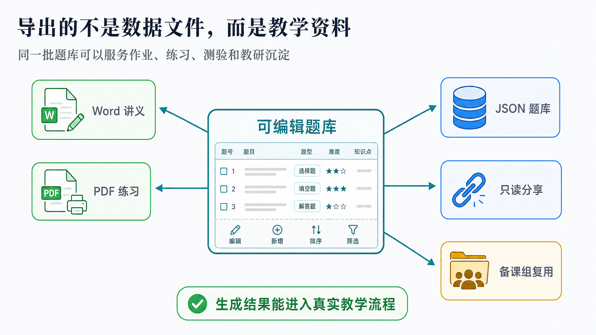
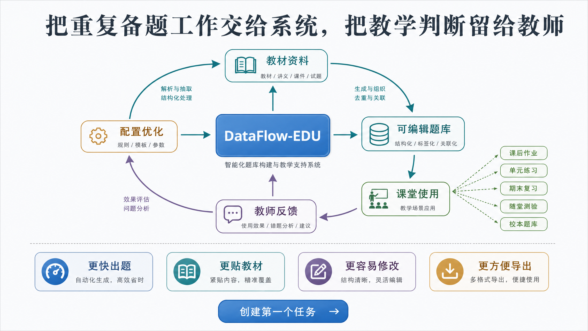

# 🌟DataFlow-EDU: 端到端学科语料库&Benchmark生成

> From One to Infinity 🌈

---

## 📖 Introducing DataFlow-EDU


---



---



---



---



---



---



---



---



---



---

## Star History

<a href="https://www.star-history.com/?repos=Heartune%2FDataFlow-EDU&type=date&legend=top-left">
 <picture>
   <source media="(prefers-color-scheme: dark)" srcset="https://api.star-history.com/image?repos=Heartune/DataFlow-EDU&type=date&theme=dark&legend=top-left" />
   <source media="(prefers-color-scheme: light)" srcset="https://api.star-history.com/image?repos=Heartune/DataFlow-EDU&type=date&legend=top-left" />
   
 </picture>
</a>

---

## 项目文件结构

```
DataFlow-EDU/
├── README.md
├── docker-compose.yml        # 单机生产部署：worker + web + backup
├── Dockerfile.python         # worker 镜像：Node API + Python Pipeline
├── Dockerfile.web            # Nginx 前端静态服务镜像
├── requirements-cloud.txt    # 云端/容器 Python 依赖
├── .env                      # 本地环境变量，含密钥；需自行创建，不入库
├── .llm_config.json          # CLI 模式 LLM 配置；需自行创建，不入库
├── DataFlow/                 # 本地 DataFlow 框架源码，提供 OperatorABC、Registry 等
├── dataflow_edu/             # 教育题库生成主管线与算子包
│   ├── edu_data_pipeline.py  # 命令行交互式 Pipeline 入口
│   ├── task_runner.py        # WebUI 非交互式任务 Runner，写入 progress.json
│   ├── config/               # Schema、配置加载/校验、全局配置与初高中多学科 presets
│   ├── operators/            # DataFlow Operator 封装与 OPERATOR_REGISTRY 注册
│   ├── pipelines/            # MinerU OCR、题目生成等阶段 Pipeline 包装
│   ├── generation/           # 两阶段生成核心逻辑与分学科 prompt 模板
│   ├── balancing/            # 能力层级与题型分布均衡补题
│   ├── ambiguity_cleaning/   # 题意二义性评分与低质题剔除
│   ├── ambiguity_refinement/ # 二义性题目精修与重评
│   ├── domain_cleaning/      # 学科领域相关性评分与清洗
│   ├── domain_refinement/    # 领域相关性精修与重评
│   ├── deduplication/        # MinHash + LSH 题干去重
│   ├── synthesis/            # 基于题目与答案生成解析 explanation
│   ├── translation/          # 中英法多语言题目/答案/解析翻译
│   ├── mcq_verify/           # 选择题选项与答案结构校验/修复
│   ├── execute/, judge/      # 接入待测模型作答与 LLM-as-a-Judge 评分
│   ├── competency_suggest/   # 联网生成知识体系、题型、核心素养配置建议
│   ├── serving/              # 多 Provider LLM 客户端与联网搜索 LLM 客户端
│   ├── export/               # JSON / Word / PDF 试卷导出
│   └── data/                 # 教材资源、示例产物与多用户任务运行目录
├── webui/                    # 教师端与管理端 Web 应用
│   ├── frontend/             # Vue 3 + Vite + Pinia 前端
│   │   ├── src/              # 路由、页面、组件、stores、API client
│   │   ├── public/           # 静态品牌资源
│   │   └── dist/             # 当前生产构建产物
│   ├── server/               # Node.js/Express API 服务
│   │   └── src/              # auth、tasks、export、share、admin、folders 等路由
│   ├── img_intro/            # README/WebUI 介绍截图
│   └── README.md
├── deploy/                   # 部署辅助资源，如 PDF 导出字体说明
├── scripts/                  # 运维脚本，如 SQLite 备份
├── tests/                    # DataFlow-EDU 单元测试
├── slide-deck/dataflow-edu/  # 项目介绍 slide 源文件、提示词与导出成品
├── utils_from_CNLaw-Bench/   # 历史项目迁移工具，仅保留必要轻量脚本
└── utils_from_ROBOTheory/    # 历史项目迁移工具，本地参考为主
```

---

## Quick Start

> 若要直接访问官网，请在浏览器中访问www.dataflow-edu.site.

1. **环境与依赖**
   - 确保项目根目录下的 `DataFlow` 目录存在（管线会通过 `sys.path` 使用本地 DataFlow 包）。
   - 在 `DataFlow`目录下运行 `pip install -e .`通过源码编译方式安装 DataFlow.

2. **配置**
   - 在项目根目录配置 LLM：创建 `.llm_config.json`，供生成、清洗、评测等算子调用大模型。
   - 建议优先通过 **WebUI 看板** 配置知识方向、能力层级、题型及各算子参数。启动 WebUI：在项目根目录执行 `cd webui && npm install && npm run dev`，浏览器访问 http://localhost:5173。也可在管线菜单中运行 **1.1 Configuration Manager**，或直接编辑 `dataflow_edu/config/edu_config.yaml`。

3. **运行管线**
   - 在项目根目录执行：
     ```bash
     python -m dataflow_edu.edu_data_pipeline
     ```
   - 根据提示选择步骤：1.1 配置 → 1.2 MinerU OCR → 2.1 生成 → 2.2 均衡（可选）→ 阶段三清洗 → 4.1 执行 → 4.2 评判。

4. **查看进度与结果**
   - 启动 WebUI 看板：` npm run dev`，浏览器访问前端（如 http://localhost:5173）查看各阶段节点状态。
   - 生成与均衡结果在 `dataflow_edu/data/generation_and_balancing/`，执行与评判结果在 `dataflow_edu/data/execute_and_judge/`。

---

## TODO
- [x] plan.md 中的计划
- [x] 贴合初高中多学科教育核心素养，如果没有适配领域，要调用能联网搜索的 LLM 给出建议，并支持修改或完全用户自定义（已通过 `CompetencySuggestOperator` + `POST /api/competency/suggest` + WizardView 第 2 步「联网建议」按钮实现）

```
